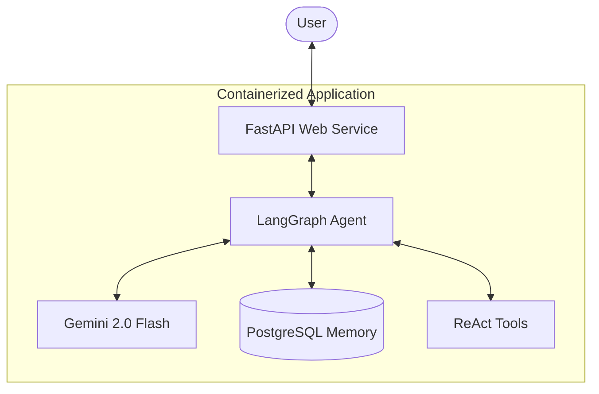
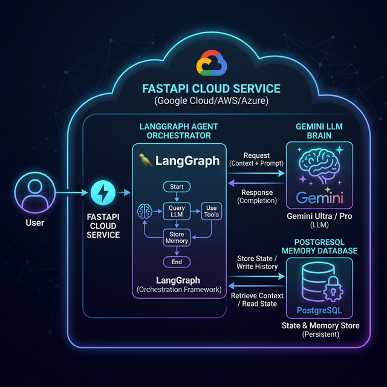

# Production LangGraph ReAct Agent

This repository contains a production-ready implementation of a LangGraph ReAct agent, wrapped in a FastAPI REST API, with persistent PostgreSQL storage and containerized using Docker.

## Architecture



## Tech Stack

- **Backend**: FastAPI, Uvicorn
- **Agent Framework**: LangGraph, Google GenAI SDK
- **Persistence**: PostgreSQL (via `PostgresSaver`)
- **Containerization**: Docker, Docker Compose

## Getting Started

### Prerequisites

- Docker and Docker Compose installed.
- A Google API Key for Gemini.

### Setup

1. **Clone the repository** (or navigate to the project directory).
2. **Configure Environment Variables**:
   ```bash
   cp .env.example .env
   ```
   Edit `.env` and add your `GOOGLE_API_KEY`.
3. **Build and Run**:
   ```bash
   docker-compose up -d --build
   ```

### Local Development (No Docker)

If you don't have Docker installed, you can run the agent locally using SQLite for persistence:

1. **Install Dependencies**:
   ```bash
   pip install -r requirements.txt
   ```
2. **Run the local script**:
   ```bash
   python run_local.py
   ```
   *Note: This will create a `checkpoints.sqlite` file in the project directory.*

## API Endpoints

### `GET /health`
Returns the health status of the API and database connection.

### `POST /chat`
Interact with the agent.
**Body:**
```json
{
  "thread_id": "unique-session-id",
  "message": "Your user prompt here"
}
```

## Development

- **agent.py**: Defines the LangGraph workflow and persistence logic.
- **main.py**: FastAPI application and endpoint definitions.
- **Dockerfile**: Defines the container image for the web service.
- **docker-compose.yml**: Orchestrates the web and database services.
```

I have also generated a high-quality architecture diagram image:


